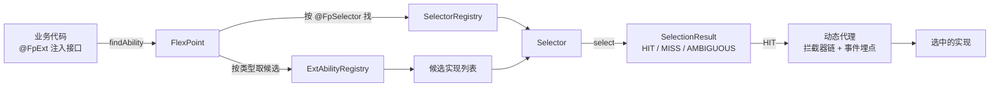

# 核心概念

Flex Point 的核心只有三件事：把一项能力抽象为**扩展点**，用**选择器**在运行期选中实现，通过**注册与查找**把二者连接起来。



## 扩展点 ExtAbility

扩展点是「同一能力的多套实现」的抽象。所有实现都实现 `ExtAbility` 接口：

```java
public interface ExtAbility {
    // 业务标识，区分不同实现（如 mall / logistics）
    String getCode();

    // 扩展点标签，承载版本等任意元数据，默认空
    default ExtTags getTags() { return ExtTags.empty(); }

    // 扩展点唯一标识，默认「接口名#实现全限定名」
    default String getExtId() { ... }
}
```

- **`getCode()`**：业务维度的区分键，最常用的路由依据。
- **`getTags()`**：完全抽象的键值对元数据（类似 HTTP 头 / RPC 元数据），不含业务概念。版本号约定放在 `version` 标签里。
- **`getExtId()`**：全局唯一标识，用于日志、监控与决策解释，一般无需重写。

### 标签 ExtTags

`ExtTags` 是不可变的键值容器，通过 Builder 构造，支持按类型读取：

```java
ExtTags tags = ExtTags.builder()
        .set("version", "2.0.0")
        .set("region", "cn")
        .build();

String version = tags.getString("version");        // "2.0.0"
String region  = tags.getString("region", "global"); // 带默认值
```

## 选择器 Selector

选择器负责从候选实现中选出目标，是路由决策的载体：

```java
public interface Selector {
    String getName(); // 全局唯一名称，供 @FpSelector 引用

    <T extends ExtAbility> SelectionResult<T> select(List<T> candidates);
}
```

一次 `select` 同时产出「命中实现 + 决策解释 + 结论」，统一 命中 / 未命中 / 歧义 三种语义。详见 [选择器](/guide/selector)。

扩展点接口通过注解声明使用的选择器，二者以名称对应：

```java
@FpSelector("codeVersionSelector")   // 注解里的名称
public interface OrderProcessAbility extends ExtAbility { ... }

public class CodeVersionSelector ... {
    public String getName() { return "codeVersionSelector"; } // getName() 返回值一致
}
```

## 注册与查找

`FlexPoint` 是框架的门面，持有扩展点注册中心、选择器注册表、监控器与事件分发器。

### 注册

```java
FlexPoint flexPoint = FlexPointBuilder.create().build();

// 注册扩展点（Spring Boot 环境下由自动注册器完成，无需手写）
flexPoint.register(new MallOrderProcessAbility());
flexPoint.register(new MallOrderProcessAbilityV2());

// 注册选择器
flexPoint.registerSelector(mySelector);
```

### 查找

`findAbility` 按扩展点接口上的 `@FpSelector` 找到选择器，取出该类型全部候选，执行一次选择：

```java
OrderProcessAbility ability = flexPoint.findAbility(OrderProcessAbility.class);
String result = ability.processOrder("order-1");
```

返回的是一个**动态代理**：调用会经过拦截器链与事件埋点（见 [扩展点 · 调用管线与拦截器](/guide/ext#调用管线与拦截器)）。

框架也提供不依赖选择器的直接查找方法，适合简单场景：

```java
// 按 code 精确匹配
OrderProcessAbility a = flexPoint.findAbilityByCode(OrderProcessAbility.class, "mall");

// 按 code + 标签匹配
OrderProcessAbility b = flexPoint.findAbilityByCodeAndTags(
        OrderProcessAbility.class, "mall", "version", "2.0.0");

// code + tags 未命中时回退到 code-only（specific → general）
OrderProcessAbility c = flexPoint.findAbilityByCodeAndTagsOrFallback(
        OrderProcessAbility.class, "mall", "version", "2.0.0");
```

## 构建 FlexPoint 实例

非 Spring 环境下用 `FlexPointBuilder` 构建：

```java
// 纯内核实例（不装配任何插件）
FlexPoint core = FlexPointBuilder.create().build();

// 装配插件（装配顺序 = 传入顺序）
FlexPoint fp = FlexPointBuilder.create()
        .withPlugin(new CodeSelectorPlugin(resolver))
        .withPlugin(new ObservabilityPlugin())
        .build();
```

Spring Boot 环境下 `FlexPoint` 实例由自动配置创建，容器中的 `Plugin` / `Selector` / `ExtAbility` Bean 会被自动收集与注册，详见 [Spring Boot 接入](/guide/springboot)。
