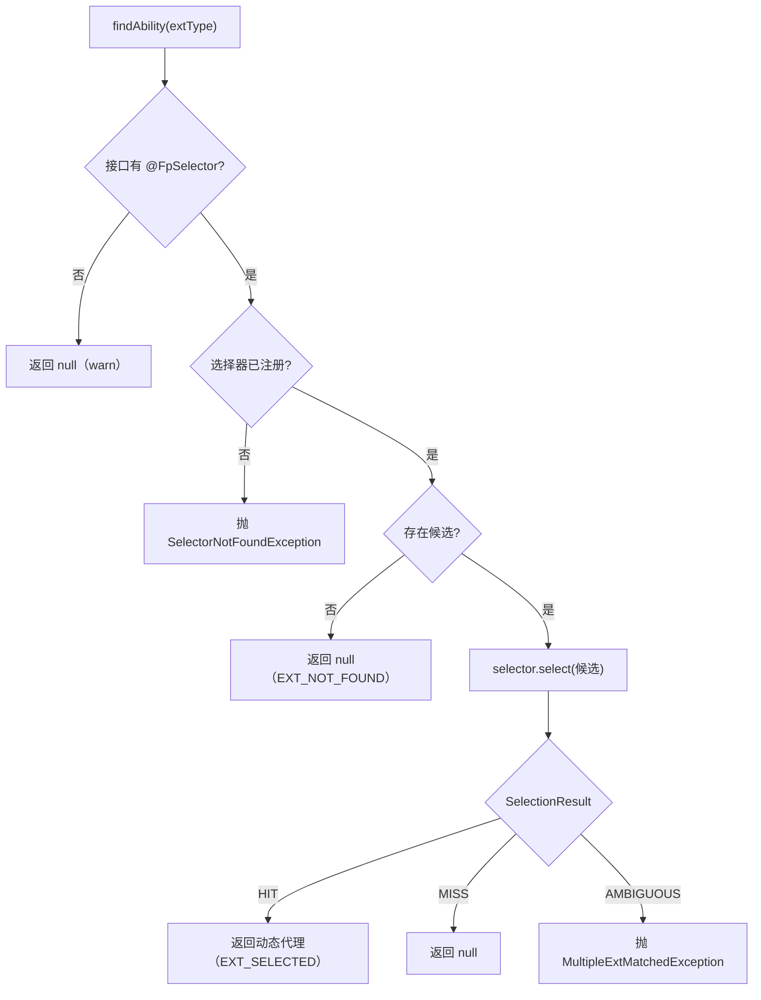

# 扩展点

扩展点（Ext Point）是 Flex Point 的核心。本页深入 `flexpoint-core` 的 `ext` 模块：扩展点的**定义**、**注册中心**、**查找与路由**、**调用管线（含拦截器 SPI 与内置事件埋点）**，以及贯穿其中的**标准上下文** `FlexPointContext`。

## 扩展点 ExtAbility

一个扩展点是「同一能力的多套实现」的抽象。所有实现都实现 `ExtAbility`：

```java
public interface ExtAbility {
    // 业务标识，区分不同实现（如 mall / logistics），路由的主依据
    String getCode();

    // 扩展点标签：承载版本等任意元数据，默认空
    default ExtTags getTags() { return ExtTags.empty(); }

    // 扩展点唯一标识，默认「扩展点接口简单名#实现全限定名」
    default String getExtId() {
        Class<? extends ExtAbility> extType = ExtUtil.getExtType(this);
        return extType.getSimpleName() + "#" + this.getClass().getName();
    }
}
```

- **`getCode()`** — 业务维度的区分键，最常用的路由依据。
- **`getTags()`** — 完全抽象的键值元数据（类似 HTTP 头 / RPC 元数据），不含业务概念；版本号约定放在 `version` 标签。
- **`getExtId()`** — 全局唯一标识，用于日志、监控与决策解释，一般无需重写。`ExtUtil.getExtType(this)` 会从实现类向上寻找**第一个**赋值兼容于 `ExtAbility` 的接口（找不到则回退 `ExtAbility.class`），该接口即扩展点的「类型键」，也是注册中心的分组依据。

### 标签 ExtTags

`ExtTags` 是不可变键值容器（构造时对入参做防御性拷贝），通过 Builder 构造，支持按类型读取：

```java
ExtTags tags = ExtTags.builder()
        .set("version", "2.0.0")
        .set("region", "cn")
        .set("weight", 10)
        .build();

String version = tags.getString("version");           // "2.0.0"
String region  = tags.getString("region", "global");  // 带默认值
Integer weight = tags.getInt("weight");               // 10（支持 Integer / 可解析的 String）
Boolean gray   = tags.getBoolean("gray");             // 支持 Boolean / "true"/"false"
Set<String> gs = tags.getSet("groups");               // String 按 [,;\s]+ 拆分为集合
boolean has    = tags.has("version", "2.0.0");        // 等值判断
```

关键方法：`get/getString/getInt/getBoolean/getSet/getList/has/size/isEmpty/keySet/getAll`（`getAll`/`keySet` 返回不可变视图）；静态 `ExtTags.empty()`、`ExtTags.builder()`。`Builder.set(k,v)` 会忽略 null 键或 null 值。

工具类 `ExtUtil` 提供从 `ExtAbility` 直接读标签的便捷方法：`getTag / getIntTag / getBooleanTag / getSetTag / hasTag / matchTag`，以及 `filterByTag / findByTag` 等候选过滤助手。

## 注册中心 ExtAbilityRegistry

扩展点实现注册到 `ExtAbilityRegistry`：

```java
public interface ExtAbilityRegistry {
    void register(ExtAbility instance);
    void unregister(ExtAbility instance);
    <T extends ExtAbility> List<T> getAllExtAbility(Class<T> extType); // 按类型取候选（快照）
    int getRegisteredCount();
}
```

行为要点（`DefaultExtAbilityRegistry`）：

- **按类型分组**：内部 `Map<Class<? extends ExtAbility>, List<ExtAbility>>`，键为 `ExtUtil.getExtType(instance)`；容器为 `ConcurrentHashMap` + `CopyOnWriteArrayList`，**线程安全**。
- **允许同类型多实现**：注册中心**不做去重**——同一扩展点接口的多个实现（甚至相同 `code`）都会保留，交由选择器在运行期收敛。
- **查询返回快照**：`getAllExtAbility(type)` 返回**新的 `ArrayList` 副本**，不会随后续注册变化；未知类型返回空列表。
- **事件**：`register` / `unregister` 分别**异步**发布 `EXT_REGISTERED` / `EXT_UNREGISTERED`。

::: tip 与选择器注册表的差异
扩展点注册**允许多实现**（这是路由的前提）；而选择器名是「资源名」，在 `SelectorRegistry` 中**禁止同名覆盖**（重复注册抛异常）。参见 [选择器](/guide/selector) 与[术语表](/guide/glossary)的「资源级唯一」。
:::

## 查找与路由

`FlexPoint` 门面提供查找入口。`findAbility` 按扩展点接口上的 `@FpSelector` 找到选择器，取出该类型全部候选，执行**一次**选择：

```java
OrderProcessAbility ability = flexPoint.findAbility(OrderProcessAbility.class);
String result = ability.processOrder("order-1"); // 调用经动态代理进入拦截器链
```

`findAbility` 的结果契约：

| 情况 | 结果 |
|------|------|
| 接口无 `@FpSelector` | 记录 warn，返回 `null` |
| `@FpSelector` 指定的选择器未注册 | 发布 `SELECTOR_NOT_FOUND`，抛 `SelectorNotFoundException` |
| 无任何候选实现 | 发布 `EXT_NOT_FOUND`，返回 `null` |
| 选择结论 `HIT` | 发布 `EXT_SELECTED`（携带决策解释），返回**动态代理** |
| 选择结论 `MISS` | 发布 `EXT_SELECTION_FAILED`，返回 `null` |
| 选择结论 `AMBIGUOUS` | 发布 `EXT_SELECTION_FAILED`，抛 `MultipleExtMatchedException` |



框架也提供不依赖选择器的直接查找，适合简单场景（同样返回代理）：

```java
// 按 code 精确匹配（单个 / 列表）
OrderProcessAbility a  = flexPoint.findAbilityByCode(OrderProcessAbility.class, "mall");
List<OrderProcessAbility> as = flexPoint.findAbilitysByCode(OrderProcessAbility.class, "mall");

// 按 code + 标签匹配（可变参数为 key,value,key,value…，需全部匹配）
OrderProcessAbility b = flexPoint.findAbilityByCodeAndTags(
        OrderProcessAbility.class, "mall", "version", "2.0.0");

// code + tags 未命中时回退到 code-only（specific → general）
OrderProcessAbility c = flexPoint.findAbilityByCodeAndTagsOrFallback(
        OrderProcessAbility.class, "mall", "version", "2.0.0");

// 取原始实现列表（不含代理，不触发拦截器）
List<OrderProcessAbility> raw = flexPoint.getAllExt(OrderProcessAbility.class);
```

## 调用管线与拦截器

`findAbility` / `findAbilityByCode*` 返回的都是 **JDK 动态代理**。每次方法调用进入一条 around 语义的拦截器链，链的最内层是内置事件埋点拦截器。这让「重试、超时、熔断、限流、缓存」等横切能力可插拔接入，而事件与监控始终生效。


链的编排规则（`FlexPoint#getProxy` + `ExtInvocationHandler`）：

- 链 = `interceptorRegistry.getInterceptors()`（按 `order()` **升序**）+ 末尾**追加** `EventPublishingInterceptor`；因此事件拦截器**恒在最内层**（贴近真实调用），无论其 order 值。
- `Object` 声明的方法（`toString/hashCode/equals`）**不进入链**，直接转发给实现。
- 无任何拦截器时，直接调用实现。

### 拦截器 SPI

自定义拦截器实现 `ExtInvocationInterceptor`，通过 `proceed()` 决定是否 / 何时 / 几次推进实际调用：

```java
public interface ExtInvocationInterceptor {
    Object intercept(ExtInvocation invocation) throws Throwable;

    default int order() { return 0; }               // 越小越靠外（越先执行）
    default String name() { return getClass().getSimpleName(); }
}

public interface ExtInvocation {
    ExtAbility getTarget();   // 被调用的扩展点实例
    Method getMethod();       // 被调用方法
    Object[] getArgs();       // 调用参数（可能为 null）
    Object proceed() throws Throwable; // 推进到下一节点；可重入（支持重试）
}
```

`proceed()` 可被同一拦截器多次调用（每次都会重新执行其后的链与终端），因此天然支持重试。示例：

```java
public class RetryInterceptor implements ExtInvocationInterceptor {
    private final int maxAttempts = 3;

    @Override
    public Object intercept(ExtInvocation invocation) throws Throwable {
        Throwable last = null;
        for (int i = 1; i <= maxAttempts; i++) {
            try {
                return invocation.proceed();
            } catch (Throwable t) {
                last = t;
            }
        }
        throw last;
    }

    @Override
    public int order() { return 300; } // 越小越外层
}
```

拦截器注册到 `InterceptorRegistry`（`register / unregister / getInterceptors`，`getInterceptors` 每次返回按 order 升序的新快照）。通常由**行为增强类插件**在 `start()` 阶段通过 `PluginContext.interceptorRegistry()` 注册、在 `stop()` 对称反注册：

```java
public class RetryPlugin extends AbstractPlugin {
    private InterceptorRegistry registry;
    private final RetryInterceptor interceptor = new RetryInterceptor();

    @Override public String getId() { return "biz.retry"; }
    @Override public void init(PluginContext ctx) { this.registry = ctx.interceptorRegistry(); }
    @Override public void start() { registry.register(interceptor); }
    @Override public void stop()  { registry.unregister(interceptor); }
}
```

官方已提供重试、超时、熔断等行为插件，见 [官方插件模块](/guide/plugins-official)。

### 内置事件埋点

`EventPublishingInterceptor`（`name = "core.event-publishing"`，`order = Integer.MAX_VALUE`）是 core 内置、始终生效的**最内层**拦截器，围绕真实方法调用发布事件：

| 事件 | 触发时机 |
|------|----------|
| `INVOKE_BEFORE` | 调用前 |
| `INVOKE_SUCCESS` | 正常返回（携带结果与耗时 ms） |
| `INVOKE_FAIL` | 目标业务异常（解包 `InvocationTargetException`，透出并重抛原始异常） |
| `INVOKE_EXCEPTION` | 框架 / 反射层异常 |

这些事件通过实例级事件总线 `EventBus` 分发；如何订阅与转为指标见 [可观测](/guide/observability)。

## 标准上下文 FlexPointContext

多数选择器需要「请求维度」的路由依据（租户、灰度键、版本…）。Flex Point 用 `FlexPointContext` 承载这些标准上下文：

```java
public final class FlexPointContext {
    // 标准字段
    private String tenantId;
    private String appCode;
    private String version;
    private String uid;
    private final Map<String, String> labels;      // 自定义标签
    private final Map<String, Object> attributes;   // 自定义属性

    public static FlexPointContext current();          // 取当前线程上下文（不存在则创建并绑定）
    public static Optional<FlexPointContext> peek();   // 只读查看，不创建
    public static void set(FlexPointContext ctx);
    public static void clear();                        // 移除绑定
    // 链式：tenantId(..)/appCode(..)/version(..)/uid(..)/label(k,v)/attr(k,v)
}
```

要点：

- 底层是**普通 `ThreadLocal`**（非 `InheritableThreadLocal`，未集成 TTL）——**不会**自动跨线程池 / 子线程传递；跨线程需手动传递。
- **务必在请求结束调用 `clear()`**，避免线程池复用导致上下文串号。

以 Web 过滤器为例：

```java
@Component
public class AppContextFilter implements Filter {
    @Override
    public void doFilter(ServletRequest req, ServletResponse resp, FilterChain chain)
            throws IOException, ServletException {
        HttpServletRequest request = (HttpServletRequest) req;
        FlexPointContext.current()
                .appCode(request.getHeader("X-App-Code"))
                .version(request.getHeader("X-App-Version"))
                .tenantId(request.getHeader("X-Tenant-Id"));
        try {
            chain.doFilter(req, resp);
        } finally {
            FlexPointContext.clear(); // 线程池复用，务必清理
        }
    }
}
```

官方选择器 `tagSelector` / `tenantSelector` / `graySelector` / `abSelector` 均从 `FlexPointContext` 读取路由依据（labels / tenantId / uid 等），详见 [官方插件模块](/guide/plugins-official)。

## 下一步

- [选择器](/guide/selector)：选择结果与决策解释。
- [插件体系（Plugin SPI）](/guide/plugin)：以插件扩展能力。
- [可观测](/guide/observability)：事件与监控。
