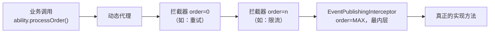

# 调用管线与拦截器

`findAbility` 返回的扩展点是一个**动态代理**。每次方法调用都会进入一条拦截器链（around 语义），链的最内层是内置的事件埋点拦截器。这让「重试、超时、熔断、限流、缓存」等横切能力可以插拔式接入，而事件与监控始终生效。



## 拦截器 SPI

自定义拦截器实现 `ExtInvocationInterceptor`，通过 `proceed()` 决定是否 / 何时 / 几次推进实际调用：

```java
public interface ExtInvocationInterceptor {
    Object intercept(ExtInvocation invocation) throws Throwable;

    default int order() { return 0; }   // 越小越靠外（越先执行）
    default String name() { return getClass().getSimpleName(); }
}
```

`ExtInvocation` 是可推进的调用上下文：

```java
public interface ExtInvocation {
    ExtAbility getTarget();  // 被调用的扩展点实例
    Method getMethod();      // 被调用方法
    Object[] getArgs();      // 调用参数
    Object proceed() throws Throwable; // 推进到链上下一节点，直至真正调用
}
```

`proceed()` 可被同一拦截器多次调用（每次都会重新执行其后的链与终端），因此天然支持重试等语义。

### 示例：一个简单重试拦截器

```java
public class RetryInterceptor implements ExtInvocationInterceptor {
    private final int maxAttempts = 3;

    @Override
    public Object intercept(ExtInvocation invocation) throws Throwable {
        Throwable last = null;
        for (int i = 1; i <= maxAttempts; i++) {
            try {
                return invocation.proceed();
            } catch (Throwable t) {
                last = t;
            }
        }
        throw last;
    }

    @Override
    public int order() { return 10; } // 靠外层，包住真正调用
}
```

## 注册拦截器

拦截器由**行为增强类插件**在 `start()` 阶段通过 `PluginContext.interceptorRegistry()` 注册：

```java
public class RetryPlugin extends AbstractPlugin {
    private InterceptorRegistry registry;
    private final RetryInterceptor interceptor = new RetryInterceptor();

    @Override public String getId() { return "biz.retry"; }

    @Override public void init(PluginContext ctx) { this.registry = ctx.interceptorRegistry(); }

    @Override public void start() { registry.register(interceptor); }

    @Override public void stop() { registry.unregister(interceptor); }
}
```

调用管线按 `order()` 升序编排（越小越外层）；内置事件埋点拦截器 `order = Integer.MAX_VALUE`，恒在最内层，保证外层行为拦截器能观测到每一次实际调用。

::: tip 官方行为增强插件
重试、超时、熔断等常见能力已有官方实现：`flexpoint-plugin-retry`、`flexpoint-plugin-resilience`，可直接引入。见 [官方插件模块](/guide/plugins-official)。
:::

## 内置事件埋点

`EventPublishingInterceptor` 是 core 内置、始终生效的最内层拦截器，围绕真正的方法调用发布事件：

| 事件 | 触发时机 |
|------|----------|
| `INVOKE_BEFORE` | 调用前 |
| `INVOKE_SUCCESS` | 正常返回（携带耗时与结果） |
| `INVOKE_FAIL` | 目标业务异常（解包 `InvocationTargetException`，透出原始异常） |
| `INVOKE_EXCEPTION` | 框架 / 反射层异常 |

这些事件通过实例级事件总线（`EventBus`）分发。事件类型完整枚举见 `EventType`，涵盖扩展点生命周期（注册/查找/选择）、调用、选择器三大类。

## 订阅事件

实现 `EventSubscriber` 并订阅事件总线，即可消费这些事件：

```java
public class MyEventSubscriber implements EventSubscriber {
    @Override
    public void onEvent(EventContext ctx) {
        // 消费事件：埋点、审计、转发监控……
    }

    @Override public boolean isAsync() { return true; } // 是否异步处理
}

// 在插件 start() 中订阅
eventBus.subscribe(new MyEventSubscriber());
```

::: tip 用官方插件替代手写订阅
官方 `flexpoint-plugin-observability` 插件已内置一个订阅者，把调用与异常事件转发给 `ExtMonitor`，无需自行编写。见 [监控与可观测](/guide/monitor)。
:::
