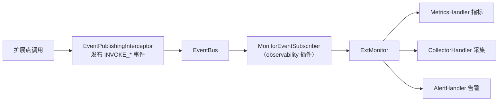

# 监控与可观测

Flex Point 的可观测由两部分组成：调用管线内置的**事件埋点**（始终发布调用生命周期事件），以及消费这些事件、沉淀为指标的 **`ExtMonitor`**。二者通过官方 `flexpoint-plugin-observability` 插件连接。



## ExtMonitor

`ExtMonitor` 是监控门面，记录调用与异常，产出每个扩展点的指标；内部是一条可扩展的处理器责任链：

```java
public interface ExtMonitor {
    void recordInvocation(ExtAbility ext, long duration, boolean success);
    void recordException(ExtAbility ext, Throwable exception);

    ExtMetrics getExtMetrics(ExtAbility ext);
    Map<String, ExtMetrics> getAllExtMetrics();

    void addHandler(MonitorHandler handler);    // 责任链节点
    void removeHandler(MonitorHandler handler);
    void clearHandlers();

    FlexPointConfig.MonitorConfig getConfig();
    default void shutdown() {}                  // 释放异步资源
}
```

## ExtMetrics 指标

每个扩展点实例维护一份调用指标：

| 方法 | 含义 |
|------|------|
| `getTotalInvocations()` | 总调用次数 |
| `getSuccessInvocations()` / `getFailureInvocations()` | 成功 / 失败次数 |
| `getSuccessRate()` | 成功率 |
| `getAverageResponseTime()` | 平均响应时间（ms） |
| `getMaxResponseTime()` / `getMinResponseTime()` | 最大 / 最小响应时间 |
| `getExceptionCount()` | 异常次数 |
| `getLastInvocationTime()` | 最后调用时间 |
| `getQPS()` | 每秒查询数 |

```java
@Autowired
private FlexPoint flexPoint;

ExtMetrics metrics = flexPoint.getExtMetrics(abilityInstance);
log.info("调用次数={}, 平均耗时={}ms, 成功率={}",
        metrics.getTotalInvocations(),
        metrics.getAverageResponseTime(),
        metrics.getSuccessRate());

// 或获取全部
Map<String, ExtMetrics> all = flexPoint.getAllExtMetrics();
```

## 启用监控

引入官方可观测插件即可把事件转化为指标：

```xml
<dependency>
    <groupId>com.flexpoint</groupId>
    <artifactId>flexpoint-plugin-observability</artifactId>
    <version>2.0.0</version>
</dependency>
```

该插件在 `start()` 时向 `ExtMonitor` 注入默认处理链（指标 / 可选采集 / 告警），并订阅实例级事件总线，把调用与异常事件转发给监控器。详见 [官方插件模块](/guide/plugins-official)。

## 监控配置

监控行为通过 `flexpoint.monitor.*` 配置（Spring Boot 环境下写在 `application.yml`）：

| 配置项 | 类型 | 默认值 | 说明 |
|--------|------|--------|------|
| `flexpoint.monitor.enabled` | boolean | `true` | 是否启用监控 |
| `flexpoint.monitor.log-invocation` | boolean | `true` | 是否记录调用日志 |
| `flexpoint.monitor.log-selection` | boolean | `true` | 是否记录选择日志 |
| `flexpoint.monitor.log-exception-details` | boolean | `true` | 是否记录异常详情 |
| `flexpoint.monitor.performance-stats-enabled` | boolean | `true` | 是否启用性能统计 |
| `flexpoint.monitor.async-enabled` | boolean | `false` | 是否异步处理监控 |
| `flexpoint.monitor.async-queue-size` | int | `1000` | 异步队列大小 |
| `flexpoint.monitor.async-core-pool-size` | int | `2` | 异步核心线程数 |
| `flexpoint.monitor.async-max-pool-size` | int | `4` | 异步最大线程数 |
| `flexpoint.monitor.async-keep-alive-time` | long | `60` | 线程保活时间（秒） |

```yaml
flexpoint:
  monitor:
    enabled: true
    async-enabled: true      # 高并发下建议异步，避免监控阻塞业务
    async-queue-size: 2000
    async-core-pool-size: 4
    async-max-pool-size: 8
```

::: info 异步监控
开启 `async-enabled` 后，监控记录在独立线程池处理，不阻塞业务调用；关闭时（`shutdown()`）会优雅释放线程池资源。
:::
