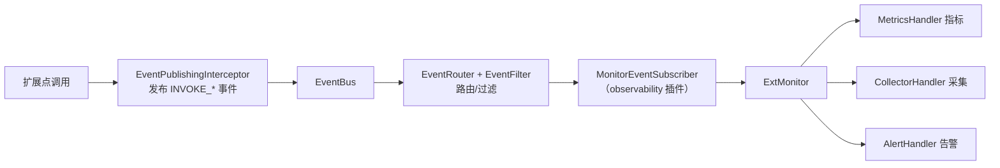

# 可观测

Flex Point 的可观测由两部分组成：调用管线内置的**事件埋点**（始终发布扩展点生命周期与调用事件），以及消费这些事件、沉淀为指标的 **监控 `ExtMonitor`**。二者通过官方 `flexpoint-plugin-observability` 插件连接。



## 事件体系

### EventBus

事件总线是**实例级**的（每个 `FlexPoint` 实例独立），负责分发事件：

```java
public interface EventBus {
    void publish(EventContext eventContext);                    // 同步发布
    CompletableFuture<Void> publishAsync(EventContext eventContext);
    void subscribe(EventSubscriber subscriber);
    void unsubscribe(EventSubscriber subscriber);
    int getTotalSubscriberCount();
    void setEventRouter(EventRouter router);
    EventRouter getEventRouter();
    void clear();
    void shutdown();
}
```

`DefaultEventBus` 行为：订阅者存于 `CopyOnWriteArrayList`（线程安全）；默认路由器为 `FilterEventRouter`；分发时先路由、再按订阅者 `isEnabled()` 过滤、然后按 `getPriority()` **升序**排序（值越小越先），逐个投递；`isAsync()` 为 true 的订阅者在总线的异步线程池上执行，否则同步执行；单个订阅者异常被捕获记录，不影响其它订阅者。

### EventType

事件类型枚举共 14 个，分三类：

| 分类 | 事件 |
|------|------|
| 扩展点生命周期 | `EXT_REGISTERED`、`EXT_UNREGISTERED`、`EXT_FOUND`、`EXT_NOT_FOUND`、`EXT_SELECTED`、`EXT_SELECTION_FAILED` |
| 调用 | `INVOKE_BEFORE`、`INVOKE_SUCCESS`、`INVOKE_FAIL`、`INVOKE_EXCEPTION` |
| 选择器 | `SELECTOR_REGISTERED`、`SELECTOR_UNREGISTERED`、`SELECTOR_FOUND`、`SELECTOR_NOT_FOUND` |

其中 `INVOKE_*` 由内置的 [`EventPublishingInterceptor`](/guide/ext#内置事件埋点) 围绕真实调用发布：`INVOKE_FAIL` 为目标业务异常（已解包 `InvocationTargetException`），`INVOKE_EXCEPTION` 为框架 / 反射层异常。

### EventContext

事件上下文承载事件全部信息（Lombok `@Data @Builder`）。常用字段：`eventId`、`eventType`、`timestamp`、`extType`、`extAbility`、`extCode`、`selectorName`、`methodName`、`methodArgs`、`result`、`exception`、`duration`、`attributes`、`threadName`。

便捷工厂：`EventContext.create(type)`、`createExtEvent(type, ext)`、`createInvokeEvent(...)`；实例方法 `withAttribute(k, v)` / `getAttribute(k)` / `getExtId()`。选择事件会在 `attributes` 中携带决策解释（键 `decisionExplanation`）。

### 订阅事件

实现 `EventSubscriber` 并订阅事件总线即可消费事件：

```java
public interface EventSubscriber {
    void onEvent(EventContext eventContext);

    default String getName()           { return getClass().getSimpleName(); }
    default int getPriority()          { return 0; }               // 越小越先
    default boolean isAsync()          { return false; }           // 是否异步处理
    default boolean isEnabled()        { return true; }
    default EventFilter getEventFilter() { return EventFilter.always(); }
}
```

```java
public class MyEventSubscriber implements EventSubscriber {
    @Override public void onEvent(EventContext ctx) {
        // 埋点、审计、转发监控……
    }
    @Override public boolean isAsync() { return true; }
    @Override public EventFilter getEventFilter() {
        return EventFilter.byEventType(EventType.INVOKE_FAIL); // 只关心失败事件
    }
}
// 在插件 start() 中：eventBus.subscribe(new MyEventSubscriber());
```

### 路由与过滤

- **`EventFilter`**（函数式）：`boolean matches(EventContext)`。内置工厂：`always()`、`never()`、`byEventType(type)`、`byExtType(class)`、`byExtCode(code)`、`bySelectorName(name)`、`byAttribute(key, value)`。`CompositeEventFilter` 支持 `and(...)` / `or(...)` 组合。
- **`EventRouter`**：`List<EventSubscriber> route(EventContext, List<EventSubscriber>)`。`DefaultEventRouter` 原样返回；`FilterEventRouter`（默认）按每个订阅者的 `getEventFilter()` 过滤——这让订阅者只收到自己关心的事件。

### EventDispatcher

`EventDispatcher` 是对 `EventBus` 的实例级封装，提供语义化发布方法（`publishExtSelected`、`publishInvokeSuccess`、`publishInvokeFail`（自动解包 `InvocationTargetException`）等），框架内部通过它发事件。业务通常只需订阅，不必直接调用它。异步线程池的拒绝策略由 `EventRejectionPolicy` 决定：`ABORT` / `DISCARD` / `DISCARD_OLDEST` / `CALLER_RUNS`。

## 监控体系

### ExtMonitor

`ExtMonitor` 是监控门面，记录调用与异常、产出每个扩展点的指标；内部是一条可扩展的处理器责任链：

```java
public interface ExtMonitor {
    void recordInvocation(ExtAbility ext, long duration, boolean success);
    void recordException(ExtAbility ext, Throwable exception);

    ExtMetrics getExtMetrics(ExtAbility ext);
    Map<String, ExtMetrics> getAllExtMetrics();

    void addHandler(MonitorHandler handler);    // 责任链节点
    void removeHandler(MonitorHandler handler);
    void clearHandlers();

    FlexPointConfig.MonitorConfig getConfig();
    default void shutdown() {}                  // 释放异步资源
}
```

### ExtMetrics 指标

每个扩展点实例维护一份调用指标：

| 方法 | 含义 |
|------|------|
| `getTotalInvocations()` | 总调用次数 |
| `getSuccessInvocations()` / `getFailureInvocations()` | 成功 / 失败次数 |
| `getSuccessRate()` | 成功率（总数为 0 时为 0.0） |
| `getAverageResponseTime()` | 平均响应时间（ms） |
| `getMaxResponseTime()` / `getMinResponseTime()` | 最大 / 最小响应时间（ms） |
| `getExceptionCount()` | 异常次数 |
| `getLastInvocationTime()` | 最后调用时间 |
| `getQPS()` | 每秒查询数 |

```java
@Autowired
private FlexPoint flexPoint;

ExtMetrics metrics = flexPoint.getExtMetrics(abilityInstance);
log.info("调用次数={}, 平均耗时={}ms, 成功率={}",
        metrics.getTotalInvocations(),
        metrics.getAverageResponseTime(),
        metrics.getSuccessRate());

// 或获取全部
Map<String, ExtMetrics> all = flexPoint.getAllExtMetrics();
```

### 处理器责任链

监控的采集逻辑以 `MonitorHandler` 责任链实现：

```java
public interface MonitorHandler {
    void handleInvocation(ExtAbility ext, long duration, boolean success, ExtMetrics metrics);
    void handleException(ExtAbility ext, Throwable exception, ExtMetrics metrics);
}
```

- 提供指标的处理器同时实现 `MetricsProvider`（`getMetrics(ext)` / `getAllMetrics()`）；`ExtMonitor` 的指标读取会委托给链上第一个 `MetricsProvider`。
- `AbstractChainExtMonitor` 维护 `CopyOnWriteArrayList<MonitorHandler>`，`config.enabled=false` 时直接短路（不记录）。
- `DefaultExtMonitor` 同步执行处理链；`AsyncExtMonitor` 在独立线程池执行（`shutdown()` 优雅释放）。`MonitorFactory.createMonitor(config, handlers)` 按 `config.asyncEnabled` 选择同步 / 异步实现。

## 启用监控

引入官方可观测插件即可把事件转化为指标：

```xml
<dependency>
    <groupId>com.flexpoint</groupId>
    <artifactId>flexpoint-plugin-observability</artifactId>
    <version>2.0.0</version>
</dependency>
```

该插件在 `start()` 时向 `ExtMonitor` 注入默认处理链（指标 → 可选采集 → 告警），并订阅 `MonitorEventSubscriber`，把 `INVOKE_SUCCESS`/`INVOKE_FAIL` 转为 `recordInvocation`、`INVOKE_EXCEPTION` 转为 `recordException`。详见 [官方插件模块 · observability](/guide/plugins-official#可观测-observability)。

## 监控配置

监控行为通过 `flexpoint.monitor.*` 配置（Spring Boot 环境下写在 `application.yml`）：

| 配置项 | 类型 | 默认值 | 说明 |
|--------|------|--------|------|
| `flexpoint.monitor.enabled` | boolean | `true` | 是否启用监控 |
| `flexpoint.monitor.log-invocation` | boolean | `true` | 是否记录调用日志 |
| `flexpoint.monitor.log-selection` | boolean | `true` | 是否记录选择日志 |
| `flexpoint.monitor.log-exception-details` | boolean | `true` | 是否记录异常详情 |
| `flexpoint.monitor.performance-stats-enabled` | boolean | `true` | 是否启用性能统计 |
| `flexpoint.monitor.async-enabled` | boolean | `false` | 是否异步处理监控 |
| `flexpoint.monitor.async-queue-size` | int | `1000` | 异步队列大小 |
| `flexpoint.monitor.async-core-pool-size` | int | `2` | 异步核心线程数 |
| `flexpoint.monitor.async-max-pool-size` | int | `4` | 异步最大线程数 |
| `flexpoint.monitor.async-keep-alive-time` | long | `60` | 线程保活时间（秒） |

```yaml
flexpoint:
  monitor:
    enabled: true
    async-enabled: true      # 高并发下建议异步，避免监控阻塞业务
    async-queue-size: 2000
    async-core-pool-size: 4
    async-max-pool-size: 8
```

## 事件线程池配置

事件总线的异步线程池通过 `flexpoint.event.*` 配置：

| 配置项 | 默认值 | 说明 |
|--------|--------|------|
| `flexpoint.event.async-core-pool-size` | `4` | 核心线程数 |
| `flexpoint.event.async-max-pool-size` | `4` | 最大线程数 |
| `flexpoint.event.async-queue-size` | `1024` | 队列容量 |
| `flexpoint.event.async-keep-alive-time` | `60` | 线程保活时间（秒） |
| `flexpoint.event.thread-name-prefix` | `flexpoint-async-event-` | 线程名前缀 |
| `flexpoint.event.rejection-policy` | `CALLER_RUNS` | 拒绝策略：`ABORT`/`DISCARD`/`DISCARD_OLDEST`/`CALLER_RUNS` |

::: info 异步资源释放
开启 `async-enabled` 后，监控记录在独立线程池处理，不阻塞业务调用；`FlexPoint#shutdown()` 会依次优雅关闭插件、监控线程池与事件线程池。
:::
