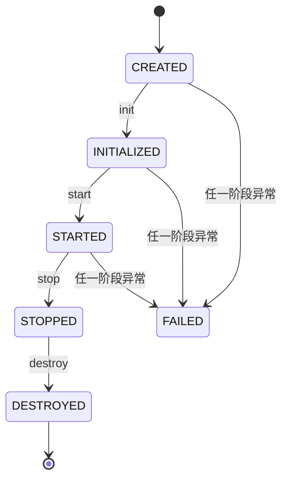

# 插件体系（Plugin SPI）

选择器、事件订阅、监控处理链、调用拦截器等扩展，在 Flex Point 中都以「插件」形式实现，由 `PluginManager` 统一注册、装配、启停与运行期治理。

## 极简插件模型

插件模型刻意保持极简：**只有一个标识 `getId()` + 一套生命周期**，不再承载依赖、顺序、版本、能力、关键性等治理概念。

```java
public interface Plugin extends PluginLifecycle {
    String getId();  // 全局唯一标识
}

public interface PluginLifecycle {
    void init(PluginContext context) throws Exception; // 读取配置、准备资源
    void start() throws Exception;                      // 注册能力
    void stop() throws Exception;                       // 反注册能力、停止异步资源
    void destroy() throws Exception;                    // 释放资源
}
```

便捷基类 `AbstractPlugin` 提供四个生命周期方法的空实现，按需覆写；`getId()` 需自行实现。

## 生命周期与状态机



状态枚举 `PluginState` 共 6 个：`CREATED`（已注册未运行）、`INITIALIZED`（init 完成）、`STARTED`（start 完成、能力已暴露）、`STOPPED`（stop 完成）、`FAILED`（任一阶段异常，降级态）、`DESTROYED`（destroy 完成）。

- **装配顺序 = 注册顺序**：`PluginManager` 按注册先后依次 `init → start`；关闭时**逆序** `stop → destroy`。
- **统一降级**：任何插件启动失败都不会中断构建 —— 标记 `FAILED`、记入加载报告、继续装配其它插件。
- **无依赖 / 顺序声明**：若插件间存在先后要求，由接入方控制注册顺序。
- **pluginId 唯一**：重复 ID 在注册期直接抛 `PluginException`。

### PluginManager

`PluginManager` 负责插件的注册、装配、启停与状态维护：

```java
public interface PluginManager {
    void register(Plugin plugin);
    void registerAll(Iterable<Plugin> plugins);
    void installAll();   // 按注册顺序 init→start
    void stopAll();      // 逆序 stop→destroy
    void enable(String pluginId);
    void disable(String pluginId);
    PluginLoadReport getLoadReport();
    Map<String, PluginState> getPluginStates();
    Plugin getPlugin(String pluginId);
}
```

`installAll()` 中任一插件 `init`/`start` 抛异常 → 该插件置 `FAILED` 并记入报告，**继续**装配后续插件（不中断构建）；`stopAll()` 中的异常仅告警。

## PluginContext：唯一受控入口

插件**不得**持有 `FlexPoint` 全局可变状态；一切通过 `init(ctx)` 拿到的受控上下文访问：

```java
public interface PluginContext {
    ExtAbilityRegistry extRegistry();       // 扩展点注册中心
    SelectorRegistry selectorRegistry();    // 选择器注册表
    EventBus eventBus();                     // 实例级事件总线
    ExtMonitor monitor();                    // 监控器
    FlexPointConfig config();                // 框架配置
    InterceptorRegistry interceptorRegistry(); // 调用拦截器注册表
}
```

## 编写一个插件

以「注册一个选择器」的插件为例，注意 `start()` 注册的资源要在 `stop()` 中对称反注册：

```java
public class TenantSelectorPlugin extends AbstractPlugin {

    public static final String PLUGIN_ID = "biz.selector.tenant";

    private SelectorRegistry registry;
    private final TenantSelector selector = new TenantSelector();

    @Override
    public String getId() { return PLUGIN_ID; }

    @Override
    public void init(PluginContext ctx) {
        this.registry = ctx.selectorRegistry();
    }

    @Override
    public void start() {
        registry.register(selector);        // 对外暴露能力
    }

    @Override
    public void stop() {
        registry.unregister(selector.getName()); // 对称反注册
    }

    @Override
    public void destroy() {
        this.registry = null;               // 释放引用
    }
}
```

## 装配方式

```java
// 显式装配（纯内核 + 指定插件），装配顺序即传入顺序
FlexPoint fp = FlexPointBuilder.create()
        .withPlugin(new CodeSelectorPlugin(resolver))
        .withPlugin(new ObservabilityPlugin())
        .build();

// 不传插件 → 构建纯内核实例，装配交由接入层（如 Spring Boot 自动配置）
FlexPoint core = FlexPointBuilder.create().build();
```

Spring Boot 环境下，容器中所有 `Plugin` 类型的 Bean 会被自动收集并装配，无需手写 `withPlugin`，见 [Spring Boot 接入](/guide/springboot)。

## 运行期治理与可观测

```java
// 运行期启停：disable 仅对 STARTED 生效（→ STOPPED，不 destroy，可再 enable）；
// enable 幂等，STOPPED 只 start，CREATED/FAILED/DESTROYED 会先 init 再 start。
flexPoint.enablePlugin("biz.selector.tenant");
flexPoint.disablePlugin("biz.selector.tenant");

// 加载报告：装配顺序（orderedPluginIds）/ 各插件状态（states）/ 失败原因（errors）
PluginLoadReport report = flexPoint.getPluginLoadReport(); // 纯内核（无插件）实例返回 null

// 当前状态快照
Map<String, PluginState> states = flexPoint.getPluginStates();
```

## 资源级唯一

选择器名等「资源名」在各自注册点**禁止同名覆盖**（重复注册直接失败）。因此两个插件若都注册同名选择器，后者会在 `start` 抛错 → 被降级为 `FAILED`，但不影响其它插件。

## 提交前自检

- `getId()` 返回全局唯一、稳定的标识
- `start()` 注册的资源在 `stop()` 中对称反注册
- `destroy()` 释放全部持有引用（置空 / 关闭线程池等）
- 不持有 `FlexPoint` 全局可变状态，只用 `PluginContext`
- 提供最小单测：装配生效 + 启停对称
