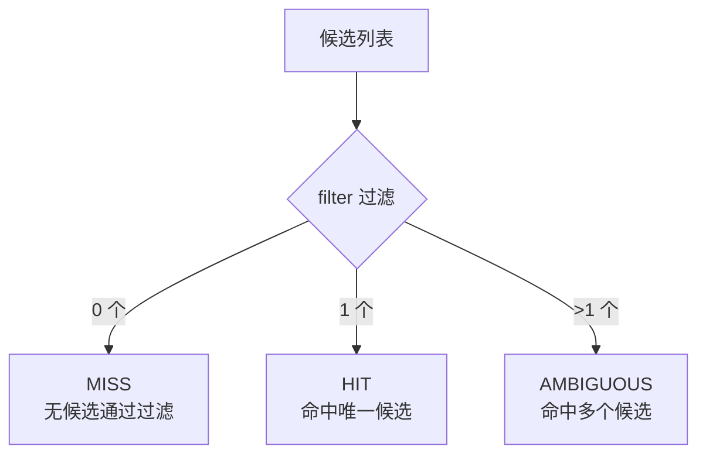

# 选择器与决策解释

选择器（`Selector`）是路由决策的核心。一次 `select` 同时产出**命中实现**、**决策解释**与**结论**，把「选择」和「为什么这样选」合并为一次计算。

## SelectionResult：一次选择，三种结论

`select(List<T>)` 返回 `SelectionResult<T>`，结论由 `DecisionExplanation.Outcome` 表达：

| 结论 | 含义 | `getSelected()` |
|------|------|-----------------|
| `HIT` | 命中唯一候选 | 非空 |
| `MISS` | 无候选通过过滤 | `null` |
| `AMBIGUOUS` | 多个候选通过过滤，未收敛 | `null` |

```java
SelectionResult<OrderProcessAbility> result = selector.select(candidates);

if (result.isHit()) {
    OrderProcessAbility target = result.getSelected();
}
// 或直接读取结论
switch (result.getOutcome()) {
    case HIT:       ...; break;
    case MISS:      ...; break;
    case AMBIGUOUS: ...; break;
}
```

框架在 `findAbility` 中按结论处理：`HIT` 返回代理；`MISS` 返回 `null`；`AMBIGUOUS` 抛出 `MultipleExtMatchedException`。三种情况都会发布对应事件并携带决策解释。

## DecisionExplanation：为什么这样选

`DecisionExplanation` 是不可变值对象，记录一次选择的完整快照，默认在 Debug 级别输出，便于本地与预发排查路由问题：

```java
DecisionExplanation ex = result.getExplanation();
ex.getSelectorName();     // 选择器名称
ex.getCandidateExtIds();  // 候选快照（extId 列表）
ex.getFilteredExtIds();   // 过滤后通过的候选
ex.getSelectedExtId();    // 命中目标（MISS/AMBIGUOUS 为 null）
ex.getOutcome();          // HIT / MISS / AMBIGUOUS
ex.getReason();           // 结论原因，如「命中多个候选(2)」
```



## 实现一个选择器

### 方式一：继承 AbstractSelector（推荐）

只需实现 `filter(...)`；模板方法自动按「空→MISS、唯一→HIT、多个→AMBIGUOUS」封装结果与解释：

```java
import com.flexpoint.core.ext.ExtAbility;
import com.flexpoint.core.selector.AbstractSelector;
import java.util.List;
import java.util.stream.Collectors;

public class TenantSelector extends AbstractSelector {

    @Override
    protected <T extends ExtAbility> List<T> filter(List<T> candidates) {
        String tenant = FlexPointContext.current().getTenantId();
        return candidates.stream()
                .filter(ext -> tenant.equals(ext.getCode()))
                .collect(Collectors.toList());
    }

    @Override
    public String getName() { return "tenantSelector"; }
}
```

### 方式二：直接实现 Selector

自行返回结果时，可用便捷工厂 `SelectionResult.of(...)` 一行封装（自动推导解释）：

```java
public class FirstNonNullSelector implements Selector {
    @Override
    public String getName() { return "firstSelector"; }

    @Override
    public <T extends ExtAbility> SelectionResult<T> select(List<T> candidates) {
        T selected = candidates.isEmpty() ? null : candidates.get(0);
        return SelectionResult.of(getName(), candidates, selected); // selected != null → HIT，否则 MISS
    }
}
```

## 绑定到扩展点

选择器通过名称与扩展点接口绑定，`getName()` 必须与 `@FpSelector` 的值一致：

```java
@FpSelector("tenantSelector")
public interface OrderProcessAbility extends ExtAbility { ... }
```

::: info 资源名禁止同名覆盖
选择器名等「资源名」在注册表内**禁止同名覆盖**，重复注册会失败。若通过插件注册官方选择器，同名冲突会导致该插件降级为 `FAILED`（不影响其它插件）。
:::

官方提供了 `codeSelector`、`codeVersionSelector` 等开箱即用的选择器，见 [官方插件模块](/guide/plugins-official)。
