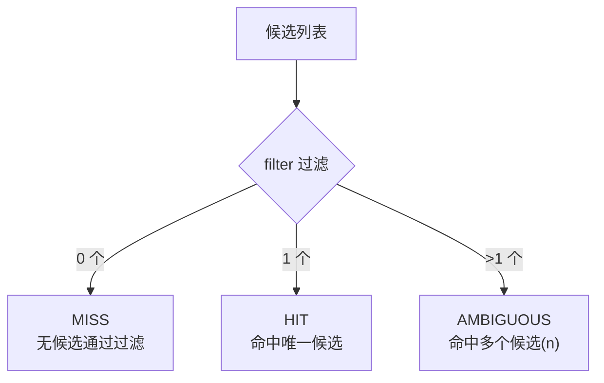

# 选择器

选择器（`Selector`）是路由决策的核心：从候选实现中选出目标。一次 `select` 同时产出**命中实现**、**决策解释**与**结论**，把「选择」和「为什么这样选」合并为一次计算。

## Selector 接口

```java
public interface Selector {
    String getName(); // 全局唯一名称，供 @FpSelector 引用

    <T extends ExtAbility> SelectionResult<T> select(List<T> candidates); // 结果非空
}
```

选择器多数需要「请求维度」的路由依据（租户、灰度键、版本…），这些从标准上下文 [`FlexPointContext`](/guide/ext#标准上下文-flexpointcontext) 读取。

## SelectionResult：一次选择，三种结论

`select(List<T>)` 返回 `SelectionResult<T>`，结论由 `DecisionExplanation.Outcome` 表达：

| 结论 | 含义 | `getSelected()` |
|------|------|-----------------|
| `HIT` | 命中唯一候选 | 非空 |
| `MISS` | 无候选通过过滤 | `null` |
| `AMBIGUOUS` | 多个候选通过过滤，未收敛 | `null` |

```java
SelectionResult<OrderProcessAbility> result = selector.select(candidates);

if (result.isHit()) {
    OrderProcessAbility target = result.getSelected();
}
// 或直接读取结论
switch (result.getOutcome()) {
    case HIT:       ...; break;
    case MISS:      ...; break;
    case AMBIGUOUS: ...; break;
}
```

`SelectionResult` 的工厂与访问器：`hit(selected, explanation)` / `miss(explanation)` / `ambiguous(explanation)` / `of(selectorName, candidates, selected)`（`selected != null` → HIT，否则 MISS）；`getSelected()` / `getExplanation()` / `getOutcome()` / `isHit()` / `isMiss()` / `isAmbiguous()`。

框架在 `findAbility` 中按结论处理：`HIT` 返回代理；`MISS` 返回 `null`；`AMBIGUOUS` 抛 `MultipleExtMatchedException`。三种情况都会发布对应事件并携带决策解释（见 [扩展点 · 查找与路由](/guide/ext#查找与路由)）。

## DecisionExplanation：为什么这样选

`DecisionExplanation` 是不可变值对象，记录一次选择的完整快照，便于本地与预发排查路由问题：

```java
DecisionExplanation ex = result.getExplanation();
ex.getSelectorName();     // 选择器名称
ex.getCandidateExtIds();  // 候选快照（extId 列表，不可变）
ex.getFilteredExtIds();   // 过滤后通过的候选
ex.getSelectedExtId();    // 命中目标（MISS/AMBIGUOUS 为 null）
ex.getOutcome();          // HIT / MISS / AMBIGUOUS
ex.getReason();           // 结论原因，如「命中多个候选(2)」
```

`Outcome` 枚举只有三个值：`HIT` / `MISS` / `AMBIGUOUS`。选择相关事件（如 `EXT_SELECTED`）会把 `DecisionExplanation` 作为属性携带（键 `decisionExplanation`），可在事件订阅端取出用于审计（官方 `flexpoint-plugin-audit` 即如此）。



## 实现一个选择器

### 方式一：继承 AbstractSelector（推荐）

只需实现 `filter(...)`；模板方法自动按「空 → MISS、唯一 → HIT、多个 → AMBIGUOUS」封装结果与解释，**不会**在歧义时抛异常（交由上层 `findAbility` 决定）：

```java
import com.flexpoint.core.context.FlexPointContext;
import com.flexpoint.core.ext.ExtAbility;
import com.flexpoint.core.selector.AbstractSelector;
import java.util.List;
import java.util.stream.Collectors;

public class TenantSelector extends AbstractSelector {

    @Override
    protected <T extends ExtAbility> List<T> filter(List<T> candidates) {
        String tenant = FlexPointContext.current().getTenantId();
        return candidates.stream()
                .filter(ext -> tenant != null && tenant.equals(ext.getCode()))
                .collect(Collectors.toList());
    }

    @Override
    public String getName() { return "tenantSelector"; }
}
```

### 方式二：直接实现 Selector

需要「多候选里挑一个」而非报歧义时（如加权随机），直接实现 `Selector`，用 `SelectionResult.of(...)` 一行封装（自动推导解释）：

```java
public class FirstNonNullSelector implements Selector {
    @Override
    public String getName() { return "firstSelector"; }

    @Override
    public <T extends ExtAbility> SelectionResult<T> select(List<T> candidates) {
        T selected = candidates.isEmpty() ? null : candidates.get(0);
        return SelectionResult.of(getName(), candidates, selected); // selected != null → HIT，否则 MISS
    }
}
```

官方 `weightSelector` 即用此方式实现「加权随机命中其一」，从而避免多候选时的 `AMBIGUOUS`。

## 绑定到扩展点

选择器通过名称与扩展点接口绑定，`getName()` 必须与 `@FpSelector` 的值一致：

```java
@FpSelector("tenantSelector")
public interface OrderProcessAbility extends ExtAbility { ... }
```

## 选择器注册表

选择器注册到 `SelectorRegistry`：

```java
public interface SelectorRegistry {
    void register(Selector selector);
    Selector getSelector(String selectorName);  // 未注册返回 null
    void unregister(String selectorName);
    boolean has(String selectorName);
    Set<String> getSelectorNames();             // 不可变快照（保持插入序）
    int size();
}
```

::: warning 资源级唯一：禁止同名覆盖
选择器名是「资源名」，`register` 遇到**重复名称直接抛 `IllegalStateException`**（「选择器名称已存在，禁止覆盖」）。若通过插件注册官方选择器，同名冲突会导致该插件在 `start()` 抛错、被降级为 `FAILED`（不影响其它插件）。这与扩展点注册「允许多实现」不同。
:::

## 官方选择器

官方选择器已独立为插件模块，开箱即用（各自的 `getName()`）：

| 选择器名 | 模块 | 路由依据 |
|----------|------|----------|
| `codeSelector` | `flexpoint-plugin-selector-code` | `code`（需业务提供 `CodeResolver`） |
| `codeVersionSelector` | `flexpoint-plugin-selector-code-version` | `code` + `version` 标签 |
| `tagSelector` | `flexpoint-plugin-selector-tag` | 上下文 labels 与候选 tags 全匹配 |
| `graySelector` | `flexpoint-plugin-selector-gray` | 灰度分流 |
| `abSelector` | `flexpoint-plugin-selector-ab` | A/B 分桶 |
| `weightSelector` | `flexpoint-plugin-selector-weight` | 候选 `weight` 标签加权随机 |
| `tenantSelector` | `flexpoint-plugin-selector-tenant` | 上下文 `tenantId` |

详见 [官方插件模块](/guide/plugins-official)。
