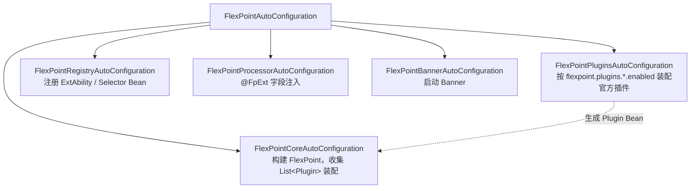

# Spring Boot 接入

`flexpoint-springboot` 在 Spring Boot 环境下提供零配置启动：自动创建 `FlexPoint` 实例、装配插件、扫描注册扩展点与选择器，并处理 `@FpExt` 注入。

## 引入依赖

```xml
<dependency>
    <groupId>com.flexpoint</groupId>
    <artifactId>flexpoint-springboot</artifactId>
    <version>2.0.0</version>
</dependency>
```

引入后即触发自动配置，无需 `@EnableXxx` 注解。

## 自动配置做了什么



- **核心实例**：`FlexPointCoreAutoConfiguration` 用 `FlexPointBuilder` 基于 `FlexPointProperties` 构建 `FlexPoint`，并收集容器中所有 `Plugin` Bean（`List<Plugin>`）一并装配（装配顺序 = Bean 收集顺序）。
- **官方插件装配**：`FlexPointPluginsAutoConfiguration` 依据 `flexpoint.plugins.<name>.enabled=true` 为 13 个官方插件生成 `Plugin` Bean（见下文；`cache` 除外，需显式 `@Bean`）。
- **自动注册**：`FlexPointSpringExtAbilityRegister` / `FlexPointSpringSelectorRegister` 在启动时扫描所有 `ExtAbility` 与 `Selector` Bean 并注册到 `FlexPoint`（受 `flexpoint.registry.enabled` 控制）。
- **注解注入**：`ExtAbilityProcessor`（`BeanPostProcessor`）为标注 `@FpExt` 的字段注入扩展点代理（受 `flexpoint.processor.enabled` 控制）。

## 核心注解

框架仅提供两个注解（均在 `com.flexpoint.common.annotations`）：`@FpSelector`（类型）与 `@FpExt`（字段）。扩展点实现类用 Spring 自带的 `@Component` 标注即可。

`@FpSelector`（类型注解）声明扩展点接口使用的选择器：

```java
@FpSelector("codeVersionSelector")
public interface OrderProcessAbility extends ExtAbility { ... }
```

`@FpExt`（字段注解）在业务 Bean 中注入扩展点接口，调用时按选择器动态路由：

```java
@RestController
public class OrderController {
    @FpExt
    private OrderProcessAbility orderProcessAbility;
}
```

扩展点实现类用 Spring 的 `@Component`（或 `@Service` 等）标注即可被自动扫描注册。

## 插件装配

`FlexPoint` 由自动配置构建时会收集容器中**所有** `Plugin` 类型 Bean（`List<Plugin>`）并按收集顺序装配。让插件生效有三种途径：

**途径一（推荐，适用 13 个官方插件）：属性开关** —— 引入插件模块依赖后，只需设置 `flexpoint.plugins.<name>.enabled=true`，`FlexPointPluginsAutoConfiguration` 便自动创建并装配对应插件 Bean，无需写代码。适用：`tag`、`gray`、`ab`、`weight`、`tenant`、`audit`、`slowcall`、`metrics`、`retry`、`resilience`、`observability`、`code`、`code-version`。其中 `code` / `code-version` 在开关之外还需容器提供对应的 `Resolver` Bean（`@ConditionalOnBean`），`observability` 可选注入 `AlertStrategy` / `MetricsCollector`（详见 [官方插件模块](/guide/plugins-official)）。

```yaml
flexpoint:
  plugins:
    tag: { enabled: true }
    retry: { enabled: true, max-attempts: 3, backoff-ms: 100 }
```

**途径二：声明 `@Bean`** —— 缓存选择器 `cache` 是装饰器，需要被包装的 `delegate`，**不纳入属性装配**，必须自行声明 Bean（原因见 [官方插件模块](/guide/plugins-official#缓存选择器-cache)）。此外，你声明的任意同类型插件 Bean 都会覆盖属性装配的默认（`@ConditionalOnMissingBean`）：

```java
@Bean
public CachingSelectorPlugin cachingSelectorPlugin(TenantSelector delegate) {
    // 用独立 name 避免与被包装 delegate 同名冲突
    return new CachingSelectorPlugin(delegate, 5000L, "cachedTenantSelector");
}
```

**途径三：直接暴露 `Selector` / `ExtAbility` Bean** —— 任何 `Selector` 或 `ExtAbility` 类型的 Bean 都会被自动注册（适合完全自定义的选择器 / 实现），无需包成插件：

```java
@Component
public class TenantSelector extends AbstractSelector {
    @Override protected <T extends ExtAbility> List<T> filter(List<T> candidates) { ... }
    @Override public String getName() { return "tenantSelector"; }
}
```

各官方插件的 pluginId、构造参数与完整配置项见 [官方插件模块](/guide/plugins-official)。

## 配置项

配置写在 `application.yml` / `application.properties`，前缀 `flexpoint`：

| 配置项 | 类型 | 默认值 | 说明 |
|--------|------|--------|------|
| `flexpoint.enabled` | boolean | `true` | 是否启用框架 |
| `flexpoint.banner-print` | boolean | `true` | 是否打印启动 Banner |
| `flexpoint.registry.enabled` | boolean | `true` | 是否启用扩展点 / 选择器自动注册 |
| `flexpoint.processor.enabled` | boolean | `true` | 是否启用 `@FpExt` 注入处理器 |
| `flexpoint.monitor.*` | - | - | 监控相关，详见 [可观测](/guide/observability) |
| `flexpoint.event.*` | - | - | 事件总线线程池相关，详见 [可观测](/guide/observability#事件线程池配置) |
| `flexpoint.plugins.<name>.*` | - | - | 官方插件属性装配，详见 [官方插件模块](/guide/plugins-official) |

```yaml
flexpoint:
  enabled: true
  registry:
    enabled: true
  monitor:
    enabled: true
    async-enabled: true
```

事件总线线程池可按需调整：

| 配置项 | 默认值 | 说明 |
|--------|--------|------|
| `flexpoint.event.async-core-pool-size` | `4` | 核心线程数 |
| `flexpoint.event.async-max-pool-size` | `4` | 最大线程数 |
| `flexpoint.event.async-queue-size` | `1024` | 队列容量 |
| `flexpoint.event.thread-name-prefix` | `flexpoint-async-event-` | 线程名前缀 |
| `flexpoint.event.rejection-policy` | `CALLER_RUNS` | 拒绝策略：`ABORT`/`DISCARD`/`DISCARD_OLDEST`/`CALLER_RUNS` |

## 完整链路小结

1. 引入 `flexpoint-springboot` + 所需官方插件模块。
2. 定义 `@FpSelector` 扩展点接口，写多套 `@Component` 实现。
3. 开启选择器：属性开关（`flexpoint.plugins.<name>.enabled=true`）或声明插件 / 选择器 Bean。
4. 在请求入口（如 Web Filter）填充 `FlexPointContext`，请求结束 `clear()`。
5. 业务 Bean 用 `@FpExt` 注入并调用。

完整可运行示例见仓库 `flexpoint-examples` 模块。
