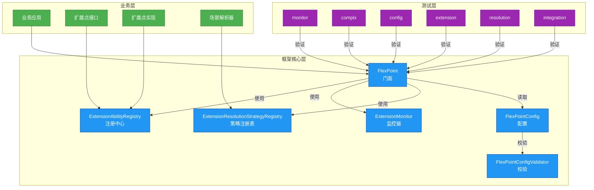

# Flex Point 核心架构

## 项目核心作用

Flex Point 是一个**灵活、可扩展、可监控**的扩展点框架，核心目标：

1. **多业务支持**：支持多业务线/多前台/多版本的动态扩展
2. **插件化**：支持即插即用的扩展点注册与管理
3. **可测试**：内置完善的单元与集成测试体系
4. **轻量级**：无外部依赖，专注核心功能
5. **可监控**：内置监控，便于问题排查

---

## 核心架构图



---

## 各模块核心作用与协作

### flexpoint-core
- **FlexPoint**：门面类，统一API，协调注册、查找、监控、策略
- **ExtensionAbilityRegistry**：扩展点注册中心，负责扩展点的注册、查找、注销、并发安全
- **ExtensionMonitor**：监控器，统计扩展点调用、异常、耗时等
- **ExtensionResolutionStrategyRegistry**：解析策略注册表，支持多策略、注解优先、上下文动态选择
- **FlexPointConfig**：配置管理，支持灵活配置与校验

### flexpoint-common
- 注解、常量、异常、工具类等基础设施

### flexpoint-spring / flexpoint-springboot
- Spring/Spring Boot集成，自动注册、自动配置、代理、属性外部化

### flexpoint-test
- 单元测试、集成测试、复杂业务规则测试，保障主流程和扩展机制的健壮性

---

## 典型主流程

### 1. 扩展点注册
```java
flexPoint.register(new MallOrderProcessAbilityV1());
flexPoint.register(new LogisticsOrderProcessAbility());
```

### 2. 解析策略注册
```java
flexPoint.registerResolver(new CustomExtensionResolutionStrategy());
```

### 3. 查找扩展点
```java
OrderProcessAbility ability = flexPoint.findAbility(OrderProcessAbility.class, context);
```

### 4. 监控统计
```java
String extId = ability.getCode() + ":" + ability.version();
flexPoint.recordInvocation(extId, 100, true);
ExtensionMonitor.ExtensionMetrics metrics = flexPoint.getExtensionMetrics(extId);
```

### 5. 注销扩展点
```java
flexPoint.unregister(extId);
```

---

## 解析策略与业务规则
- 支持注解（@ExtensionResolverSelector）指定策略
- 支持上下文（如ThreadLocal、参数、环境变量）动态决策
- 支持多字段（如code+version）匹配、灰度、A/B等复杂业务规则

---

## 测试体系与用例覆盖

- **ConfigTest**：配置默认值、校验、禁用场景
- **ExtensionRegistryTest**：注册、查找、注销、重复注册、并发注册
- **MonitorTest**：调用统计、异常统计、指标重置
- **ResolutionTest**：策略注册、注解优先、上下文动态选择、策略未找到异常
- **IntegrationTest**：注册、查找、解析、监控、注销等全流程
- **complx/**：灰度、A/B、多字段动态匹配等复杂业务规则

---

## 设计模式应用

| 设计模式 | 应用场景 | 实现类 |
|---------|---------|--------|
| 门面模式 | 统一API | FlexPoint |
| 工厂模式 | 扩展点创建 | ExtensionAbilityRegistry |
| 策略模式 | 解析策略 | ExtensionResolutionStrategy |
| 代理模式 | Spring集成 | ExtensionAbilityInvocationHandler |
| 注册模式 | 扩展点管理 | ExtensionAbilityRegistry |
| 观察者模式 | 监控 | ExtensionMonitor |
