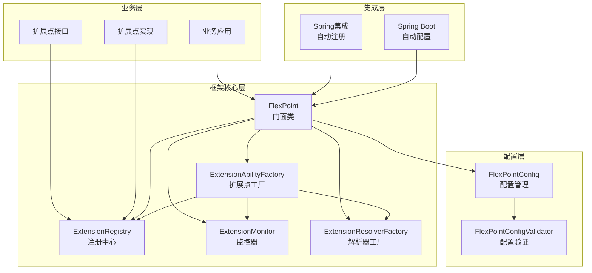
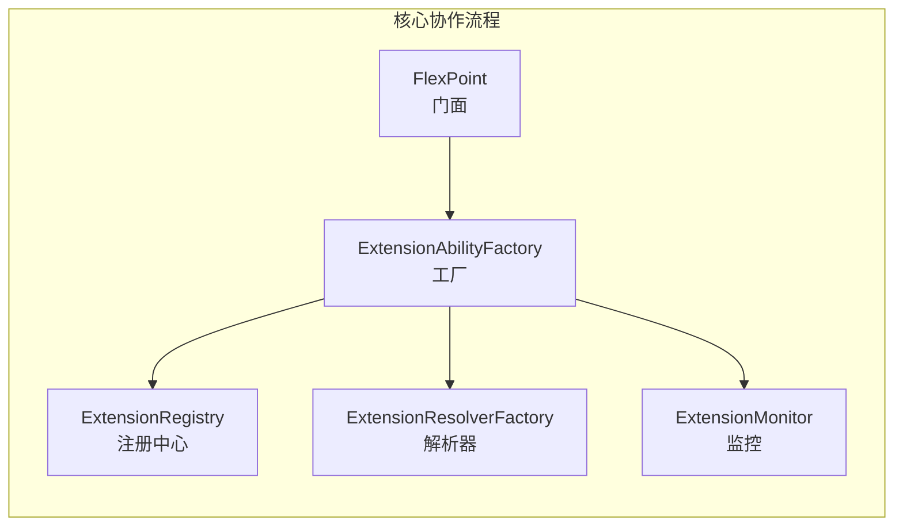
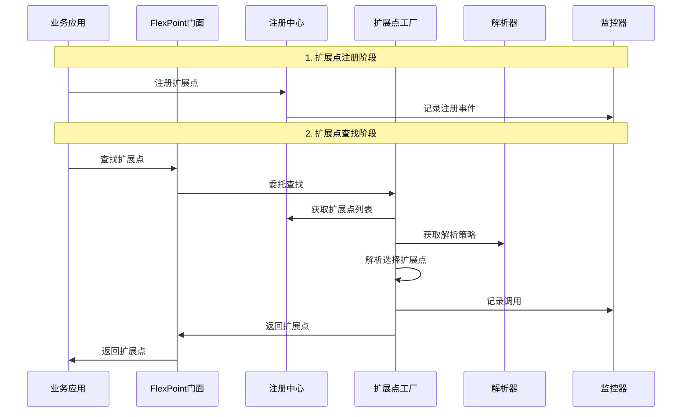
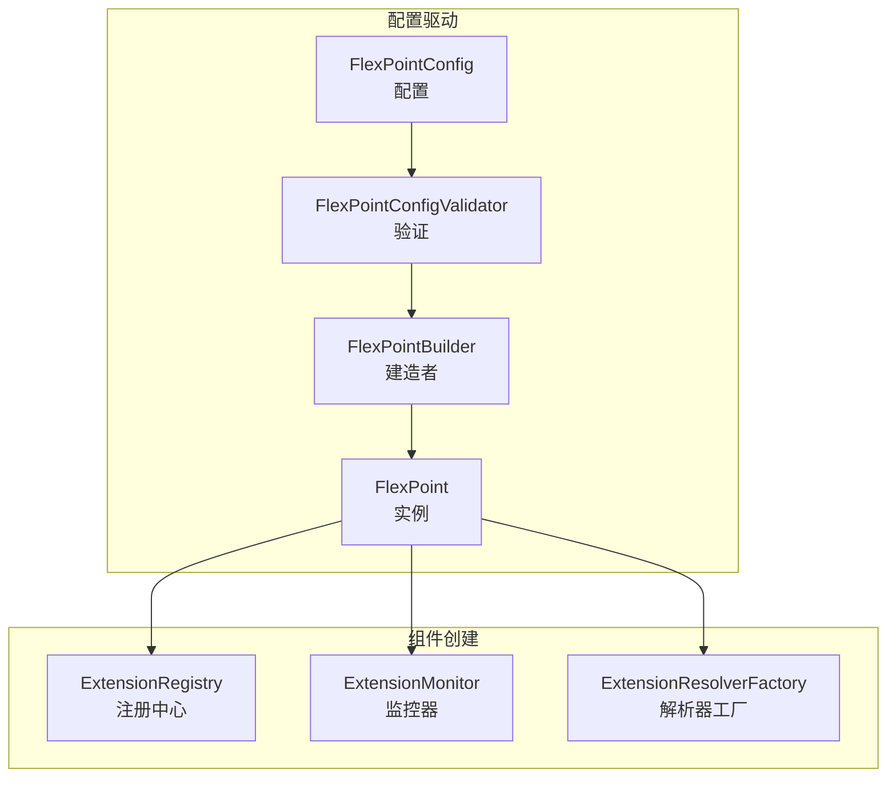

# Flex Point 核心架构

## 项目核心作用

Flex Point 是一个**灵活扩展点框架**，核心作用是：

1. **业务逻辑解耦**: 通过扩展点模式实现业务逻辑的动态选择
2. **多前台支持**: 根据不同的业务代码（code）选择不同的实现
3. **插件化架构**: 支持业务功能的即插即用
4. **统一管理**: 提供扩展点的注册、查找、监控等统一管理

## 核心架构图



## 模块协作方式

### 1. 核心模块协作



**协作方式:**
- **FlexPoint**: 提供统一API，协调各组件工作
- **ExtensionAbilityFactory**: 负责扩展点的查找和创建
- **ExtensionRegistry**: 管理扩展点的存储和检索
- **ExtensionResolverFactory**: 提供扩展点解析策略
- **ExtensionMonitor**: 监控扩展点调用情况

### 2. 扩展点生命周期



### 3. 配置驱动协作



## 各模块核心作用

### flexpoint-common (公共基础)
**作用**: 提供框架的基础设施
- **注解**: 定义扩展点相关的注解
- **常量**: 框架常量定义
- **异常**: 统一的异常处理
- **工具类**: 通用工具方法

### flexpoint-core (核心功能)
**作用**: 实现框架的核心逻辑
- **FlexPoint**: 框架门面，提供统一API
- **ExtensionAbilityFactory**: 扩展点工厂，负责查找和创建
- **ExtensionRegistry**: 注册中心，管理扩展点存储
- **ExtensionMonitor**: 监控器，提供调用统计
- **ExtensionResolverFactory**: 解析器工厂，管理解析策略
- **FlexPointConfig**: 配置管理，支持灵活配置

### flexpoint-spring (Spring集成)
**作用**: 提供Spring环境下的集成支持
- **注解处理器**: 处理扩展点注解
- **代理生成**: 实现扩展点的动态代理
- **自动注册**: 自动扫描和注册扩展点

### flexpoint-springboot (Spring Boot自动配置)
**作用**: 提供Spring Boot的自动配置
- **自动配置类**: 自动配置FlexPoint相关Bean
- **配置属性**: 支持外部化配置
- **组件工厂**: 根据配置创建组件

### flexpoint-dependencies-bom (依赖管理)
**作用**: 统一管理依赖版本
- **版本管理**: 避免版本冲突
- **简化依赖**: 简化项目依赖管理

### flexpoint-examples (示例模块)
**作用**: 提供使用示例和最佳实践
- **Java原生示例**: 展示非Spring环境下的使用
- **Spring Boot示例**: 展示Spring Boot环境下的使用

### flexpoint-test (测试模块)
**作用**: 提供测试用例和验证
- **单元测试**: 验证各模块功能
- **集成测试**: 验证模块协作

## 设计模式应用

| 设计模式 | 应用场景 | 实现类 |
|---------|---------|--------|
| **门面模式** | 提供统一API | FlexPoint |
| **工厂模式** | 扩展点创建管理 | ExtensionAbilityFactory |
| **建造者模式** | 对象构建 | FlexPointBuilder |
| **策略模式** | 扩展点解析 | ExtensionResolutionStrategy |
| **代理模式** | Spring集成 | ExtensionAbilityInvocationHandler |
| **注册模式** | 扩展点管理 | ExtensionRegistry |

## 扩展点工作流程

### 1. 定义阶段
```java
// 定义扩展点接口
public interface OrderProcessAbility extends ExtensionAbility {
    String processOrder(String orderId, double amount);
}
```

### 2. 实现阶段
```java
// 实现扩展点
public class MallOrderProcessAbility implements OrderProcessAbility {
    @Override
    public String getCode() {
        return "mall";
    }
    
    @Override
    public String processOrder(String orderId, double amount) {
        return "商城订单处理完成";
    }
}
```

### 3. 注册阶段
```java
// 注册扩展点
flexPoint.register(OrderProcessAbility.class, new MallOrderProcessAbility());
```

### 4. 使用阶段
```java
// 使用扩展点
Map<String, Object> context = Map.of("code", "mall");
OrderProcessAbility processor = flexPoint.findAbility(OrderProcessAbility.class, context);
String result = processor.processOrder("ORDER001", 1000.0);
```

## 核心优势

1. **轻量级**: 无外部依赖，专注于核心功能
2. **灵活性**: 支持自定义解析策略
3. **易用性**: 提供多种使用方式（Spring Boot、Spring、Java原生）
4. **可监控**: 内置监控功能，便于问题排查
5. **可扩展**: 模块化设计，支持功能扩展 