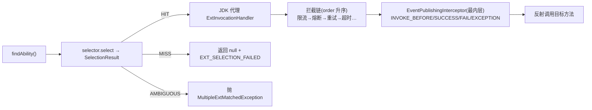

# Flex Point 核心架构（2.0）

> 本文与 2.0 代码对齐（`revision = 2.0.0-SNAPSHOT`）。更完整的使用文档见官网 `docs/`（VitePress）。

## 项目核心作用

Flex Point 是一个**轻量、可扩展、可治理、可观测**的扩展点（Ext Point）框架，核心目标：

1. **多场景适配**：按 租户/应用/版本/标签/灰度/AB 等维度动态选择业务实现
2. **插件化治理**：能力以「插件」统一接入，具备生命周期、装配、运行期启停
3. **行为增强**：调用管线提供 around 拦截 SPI（重试/超时/熔断/限流…）
4. **可观测**：事件 + 监控链 + 决策解释，问题可追溯
5. **轻量内核**：core 只做 SPI 与框架机制，不依赖 Spring；具体能力全下沉插件
6. **配置即装配**：Spring Boot 下「引入插件模块 + `flexpoint.plugins.*` 开关」即用，无需编码

---

## 分层与模块

```
flexpoint-dependencies-bom   依赖版本 BOM
flexpoint-common             注解(@FpExt/@FpSelector)、常量、异常
flexpoint-core               内核 SPI 与机制（不依赖 Spring）
flexpoint-spring             Spring 集成（Bean 扫描注册、@FpExt 代理）
flexpoint-springboot         Spring Boot 自动配置 + 「配置即装配」
flexpoint-plugin-all         官方插件聚合（每插件一个独立子模块，14 个）
flexpoint-test               单元/集成/并发测试
flexpoint-examples           Java 原生 / Spring Boot 接入示例
```

**边界原则**：`core` 只保留干净 SPI 与默认实现（注册中心、选择 SPI、插件管理、事件总线、监控链、调用拦截 SPI、标准上下文）；所有**具体能力**（各类选择器、观测/行为插件）一律作为 `flexpoint-plugin-*` 独立模块。

---

## 核心架构图

```mermaid
graph TB
    subgraph 业务层
        A1[业务应用]
        A2["扩展点接口<br/>@FpSelector / @FpExt"]
        A3[扩展点实现 ExtAbility]
    end

    subgraph "flexpoint-core（内核 SPI）"
        F[FlexPoint 门面]
        B[FlexPointBuilder]
        R[ExtAbilityRegistry<br/>注册/快照/计数/资源唯一]
        S[SelectorRegistry + Selector<br/>select→SelectionResult]
        PM[PluginManager<br/>装配=注册序·统一降级]
        IR[InterceptorRegistry<br/>调用拦截 SPI]
        PX["调用管线<br/>ExtInvocationHandler → 拦截链 → EventPublishingInterceptor → 反射"]
        EV[EventBus / EventDispatcher]
        MON[ExtMonitor + Handler 链]
        CTX[FlexPointContext 标准上下文]
        CFG[FlexPointConfig + Validator]
    end

    subgraph "flexpoint-plugin-*（官方插件）"
        PS[选择器: code/code-version/tag/gray/ab/weight/tenant/cache]
        PO[观测: observability/audit/slowcall/metrics]
        PB[行为: retry/resilience]
    end

    subgraph 接入层
        SB[Spring Boot 自动配置<br/>flexpoint.plugins.* 配置即装配]
    end

    A1 --> F
    A2 & A3 --> R
    A2 -->|@FpSelector| S
    B -->|构建装配| F
    F --> R & S & MON & CFG
    F -->|findAbility| PX
    S -->|读取| CTX
    PX --> IR
    PX --> EV --> MON
    PM -->|注册能力/拦截器| S & EV & MON & IR
    PS --> S
    PO --> EV & MON
    PB --> IR
    SB -->|按配置装配 Plugin Bean| PM
    CFG --> CFG

    classDef biz fill:#4CAF50,stroke:#2E7D32,color:white
    classDef core fill:#2196F3,stroke:#0D47A1,color:white
    classDef plugin fill:#FF9800,stroke:#E65100,color:white
    classDef adapt fill:#9C27B0,stroke:#6A1B9A,color:white
    class A1,A2,A3 biz
    class F,B,R,S,PM,IR,PX,EV,MON,CTX,CFG core
    class PS,PO,PB plugin
    class SB adapt
```

---

## core 各子模块详解

### ext —— 扩展点（定义 / 注册 / 调用）
- `ExtAbility`：能力契约（`getCode()` / `getTags()` / `getExtId()`）；实现类可为非 public。
- `ExtTags`：抽象元数据键值（版本等以约定 tag 表达）。
- `ExtAbilityRegistry` / `DefaultExtAbilityRegistry`：注册/注销、**快照读取**（并发安全）、统一计数 `getRegisteredCount()`；纯读取不发事件。
- `ext.proxy.ExtInvocationHandler`：调用管线的通用驱动（编排「拦截链 → 终端」）。
- `ext.proxy.EventPublishingInterceptor`：**核心内置**事件埋点拦截器（`order=MAX`，最内层，始终生效）。
- `ext.interceptor`：`ExtInvocation` / `ExtInvocationInterceptor`（around）/ `ExtInvocationTerminal` / `InterceptorRegistry`+`Default` / 可重入链 `DefaultExtInvocation`。

### selector —— 选择器
- `Selector`：`<T> SelectionResult<T> select(List<T>)` + `getName()`。
- `AbstractSelector`：只需实现 `filter(...)`，命中语义（HIT/MISS/AMBIGUOUS）由基类产出。
- `SelectionResult`：命中实现 + `DecisionExplanation`（候选/过滤/结论）一次产出。
- `SelectorRegistry` / `DefaultSelectorRegistry`：按名注册（**资源级唯一**，同名禁止覆盖）、`getSelectorNames()/size()` 可观测。

### plugin —— 插件体系
- `Plugin`（`String getId()` + 生命周期）/ `AbstractPlugin` / `PluginState`。
- `PluginManager` / `DefaultPluginManager`：**装配顺序=注册顺序**，`init→start`；任何失败**统一降级**（FAILED + 报告 + 继续）；逆序 `stop→destroy`；运行期 `enable/disable`；`PluginLoadReport`。
- `PluginContext` / `DefaultPluginContext`：受控暴露 `extRegistry/selectorRegistry/eventBus/monitor/config/interceptorRegistry`。

### event —— 事件
- `EventBus`/`DefaultEventBus`、`EventDispatcher`、`EventContext`、`EventType`、`EventSubscriber`、`router/*`、`filter/*`、`EventRejectionPolicy`（线程池可配置）。

### monitor —— 监控
- `ExtMonitor`、`AbstractChainExtMonitor`、`DefaultExtMonitor`/`AsyncExtMonitor`、`MonitorFactory`、`MonitorHandler`/`MetricsProvider`、`ExtMetrics`/`Impl`。

### context —— 标准上下文
- `FlexPointContext`：线程级 `tenantId/appCode/version/uid/labels/attributes`；选择器据此路由，**无需业务 Resolver**。

### 门面与构建
- `FlexPoint`：统一 API（findAbility、register、selector、metrics、shutdown、plugin 启停/报告）。
- `FlexPointBuilder`：装配组件 + 插件（持有 `PluginManager`/`InterceptorRegistry`，shutdown 逆序停止）。

---

## 调用管线（Invocation Pipeline）



- 拦截器**环绕**事件埋点终端：每次真正调用都发事件（重试可见多组事件）。
- 无拦截器时直连终端，零额外开销；`Object` 方法（toString/hashCode/equals）短路不埋点。

---

## 官方插件（每插件一模块，配置即装配）

| 类别 | 模块 | 能力 |
|------|------|------|
| 选择器 | selector-code / -code-version / -tag / -gray / -ab / -weight / -tenant / -cache | Code / 版本 / 标签 / 灰度 / A-B / 权重 / 租户 / 缓存 |
| 观测 | observability / audit / slowcall / metrics | 监控链融合 / 审计日志 / 慢调用告警 / 指标汇总 |
| 行为 | retry / resilience | 重试 / 超时+熔断（基于拦截器 SPI） |

Spring Boot：`FlexPointPluginsAutoConfiguration` 按 `flexpoint.plugins.<name>.enabled=true` + `@ConditionalOnClass` 条件装配为 `Plugin` Bean，被核心自动配置收集进 `FlexPoint`。

---

## 典型主流程

```java
// 1) 构建（Java 原生；Spring Boot 下自动装配）
FlexPoint fp = FlexPointBuilder.create()
        .withPlugin(new CodeVersionSelectorPlugin(() -> FlexPointContext.current().getAppCode()))
        .build();

// 2) 注册扩展点实现
fp.register(new MallOrderProcessAbility());
fp.register(new LogisticsOrderProcessAbility());

// 3) 入口填充标准上下文（如 Web Filter）
FlexPointContext.current().appCode("mall").version("1.0.0");

// 4) 查找并调用（按 @FpSelector 指定的选择器路由）
OrderProcessAbility ability = fp.findAbility(OrderProcessAbility.class);
String r = ability.processOrder("O1", "...");

// 5) 观测（需装配 observability 插件）
ExtMetrics m = fp.getExtMetrics(ability);
```

自定义选择器（新 SPI）：

```java
public class CustomSelector extends AbstractSelector {
    @Override protected <T extends ExtAbility> List<T> filter(List<T> candidates) {
        String code = FlexPointContext.current().getAppCode();
        return candidates.stream().filter(e -> code.equals(e.getCode())).collect(Collectors.toList());
    }
    @Override public String getName() { return "customSelector"; }
}
```

---

## 支持的路由/治理能力
- 多字段匹配（code + version + tags）、标签路由、灰度（百分比哈希）、A/B 分桶、权重、租户隔离+回退、结果缓存。
- 行为增强：重试、超时、熔断（可扩展限流）。
- 决策解释（HIT/MISS/AMBIGUOUS + 候选/过滤链路）随选择事件产出，便于排查。

---

## 测试体系与覆盖
- **core**：注册中心并发一致性、选择器/决策解释、插件生命周期与管理器、上下文、调用拦截器（可重入/around）、事件语义、配置校验。
- **springboot**：`flexpoint.plugins.*` 配置装配集成。
- **plugin-*（每模块自带）**：各选择器路由、观测订阅/统计、重试/超时/熔断。
- **complex**：灰度、A/B 等复杂业务规则。
- 全反应堆 `mvn clean test` 全绿（本地非发布构建可 `-Dgpg.skip=true`）。
